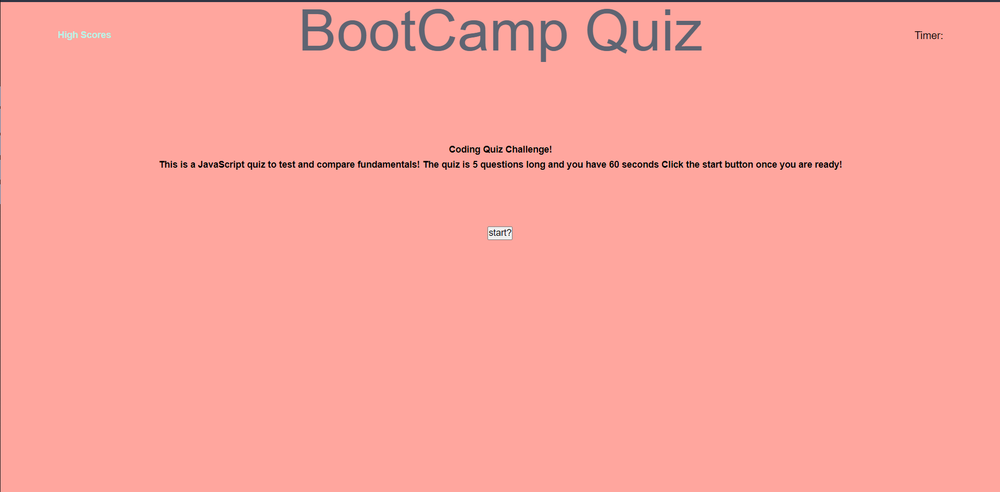

# Challenge4

Refenrece: https://www.sanfoundry.com/1000-javascript-questions-answers/

This program is a 5 question multiple choice quiz
It has a timer that starts at 50 and goes down 10 seconds when you get the question wrong
When timer runs out the quiz end
When all 5 questions are answered the quiz ends
After the quiz ends user will be able to enter their name if they got more than 2 questions right to add to the high score list
User will be able to click high score to see all saved high scores

https://manuelc0159.github.io/Challenge4/

